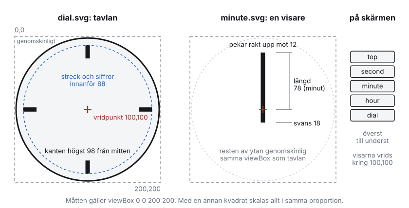

# Klockpaket: egna urtavlor

En egen urtavla laddas upp till servern som ett **klockpaket** (`.tmclock`)
under Inställningar → Skärmar och klocka → Egna klockor. Klockan blir då en
stil bland de andra. Den kan väljas för alla klockskärmar, för en enskild
skärm via dess verktygsrad och i deltagarvyn. Den gäller för alla träffar på
servern.

Ett klockpaket innehåller bilder och inställningar, men ingen kod. Tavlan och
visarna är bilder, och hur visarna går står i `clock.json`. Därför kan ett
uppladdat paket aldrig köra något i en webbläsare.

Det här dokumentet beskriver:
- hur ett paket ska utformas för att fungera;
- hur det skalar från den minsta förhandsbilden på 44 px till en 4K-TV;
- hur du provar det innan du laddar upp.

## Snabbstart

1. **Hämta exemplet.** Välj "Ladda ner exempelpaketet" under Egna klockor,
   eller kör:
   ```
   python -m tmbox_gateway.clock_pack example mitt-ur/
   ```
2. **Rita** tavlan och visarna enligt [mallen](#mallen) nedan, och exportera
   varje lager som en egen SVG.
3. **Ändra `clock.json`:** namn, id och hur visarna går.
4. **Se klockan i alla storlekar** som TrainMeet visar den:
   ```
   python -m tmbox_gateway.clock_pack preview mitt-ur/
   ```
   Kommandot skriver `mitt-ur-preview.html`. Öppna filen i en webbläsare.
5. **Kontrollera och packa** paketet:
   ```
   python -m tmbox_gateway.clock_pack check mitt-ur/
   python -m tmbox_gateway.clock_pack build mitt-ur/ -o mitt-ur.tmclock
   ```
6. **Ladda upp, kryssa i rätten att använda tavlan och välj klockan som stil.**
   Ladda upp igen med samma `id` för att byta version.

`check` och `preview` använder samma regler som servern. Det som godtas där
godtas också vid uppladdningen.

## Var klockan visas, och hur stor

Klockan ritas i många storlekar. Ett paket ska fungera i alla.

| Var | Storlek på skärmen |
|---|---|
| Inställningarnas lista över egna klockor | 44 px |
| Stilvalet i inställningarna | 52 px |
| Deltagarvyn | 84 px |
| Klockskärmen på en telefon | cirka 350 px |
| Klockskärmen på en laptop | cirka 680 px |
| Klockskärmen på en surfplatta, stående | cirka 730 px |
| Klockskärmen på en TV, 1080p, liggande eller stående | 960 px |
| Klockskärmen på en 4K-TV | 960 px, ritade med 1 920 skärmpixlar |

**Så skalar skärmarna:**
- **Klockskärmen** tar knappt 90 % av skärmens kortsida, både på liggande och
  stående skärmar.
- **En stoppad klocka** krymper till cirka 70 % av den storleken, ritas med
  halv genomskinlighet och får en rad under som säger varför den står.

Det ger två krav:

- **Klockan ska gå att läsa på 84 px.** Där bär timstrecken och visarna
  avläsningen; tunna minutstreck får försvinna.
- **Klockan ska vara skarp på 1 920 pixlar.** Det klarar en SVG alltid. En PNG
  klarar det bara om den är tillräckligt stor.

## Mallen



**Alla lager ritas på samma kvadratiska yta.** Skärmen lägger lagren exakt på
varandra och vrider visarna kring ytans mitt. Exemplet och måtten nedan
använder `viewBox="0 0 200 200"` med mitten i `100,100`. En annan kvadrat går
också bra, och då gäller samma proportioner.

**Tavlan (`dial`):**
- Rita tavlan som en cirkel med mitten i `100,100` och radien högst 98, så att
  kanten inte klipps.
- Ge tavlan en egen fylld bakgrund. Skärmen bakom kan vara mörk eller ljus.
- Lämna ytan utanför cirkeln genomskinlig. Annars syns hörnen som en fyrkant.
- Håll streck och siffror innanför radien 88, så att de inte krockar med
  kanten.

**Visarna (`hour`, `minute`, `second`):**
- Varje visare ritas pekande rakt upp mot 12, med vridpunkten exakt i
  `100,100`.
- Resten av ytan ska vara genomskinlig. En vit bakgrund i ett visarlager
  döljer tavlan.
- En svans bakåt förbi mitten går bra.
- Visarens spets får inte nå utanför tavlans kant. Den når dit i alla
  vinklar, så längden från mitten ska vara högst 96.

**Lagret ovanpå (`top`):** till exempel navet som täcker visarnas fäste, eller
ett glas med reflex. Det står still och ritas över visarna.

## Lagren

```
mitt-ur.tmclock (zip)
├── clock.json     vad paketet heter, vilka lager det har och hur visarna går
├── dial.svg       tavlan: allt som står still (krävs)
├── hour.svg       timvisaren (krävs)
├── minute.svg     minutvisaren (krävs)
├── second.svg     sekundvisaren (valfri; utan den visas inga sekunder)
└── top.svg        något ovanpå visarna, till exempel navet (valfritt)
```

Filerna kan heta vad som helst, eftersom `clock.json` anger dem.

## Utforma så att klockan skalar

### Rita i vektor (SVG)

SVG är skarp i alla storlekar, från 44 px till 4K. Använd PNG bara för något
som inte går att rita, till exempel ett fotograferat ur.

**Krav på en PNG:**
- Den ska vara kvadratisk och minst 512 px i sida. Mindre bilder nekas.
- Under 1 024 px varnar kontrollen.
- Använd 2 048 px, så blir bilden skarp på en 4K-TV.
- Spara med genomskinlighet (RGBA). Det är nödvändigt för visarna och för
  hörnen runt tavlan.

### Linjer och streck

Måtten gäller en yta på 200. Inom parentes står de som andel av sidan, och de
gäller oavsett yta.

| Del | Minst | Väl avvägt |
|---|---|---|
| Minutstreck | 1 (0,5 %) | 1,5–2 |
| Timstreck | 3 (1,5 %) | 4–7, längd 14–18 |
| Timvisare | 5 (2,5 %) | 6–8, längd 50–55 |
| Minutvisare | 3 (1,5 %) | 4–6, längd 75–80 |
| Sekundvisare | 1,5 (0,75 %) | 1,5–2, längd 70–80 |
| Kant runt tavlan | 2 (1 %) | 3–4 |

**Vid 84 px är en enhet 0,4 px.** Ett minutstreck på 1 syns då som en svag
grå prick. Timstrecken och visarna måste därför bära avläsningen ensamma.
Kontrollen varnar för linjer under 0,5 % av sidan.

### Text

**Gör om text till banor (path) i ritprogrammet.** I Inkscape heter det
"Objekt till bana", i Illustrator "Skapa konturer" och i Figma "Outline
stroke" eller "Flatten".

En SVG som visas som bild kan inte ladda typsnitt. Den använder de typsnitt
som råkar finnas på varje skärm, så siffror kan se olika ut på TV:n, telefonen
och laptopen. Kontrollen varnar för `<text>`.

### Färg och kontrast

Paketets färger är fasta. Skärmarna kan visa mörkt eller ljust läge, och
utan en mörk variant ser tavlan likadan ut i båda. Därför:

- Ge tavlan en egen fylld bakgrund och en tydlig kant.
- Låt visarna och strecken kontrastera starkt mot tavlan, till exempel svart
  mot vitt eller vitt mot mörkgrått.
- Sekundvisaren får gärna ha en egen färg.

### Mörkt läge

Ett paket kan ha en **mörk variant**. Den används på skärmar och i deltagarvyn
när de visar mörkt läge. En ljus tavla kan annars lysa starkt på en TV i en
mörk lokal.

- Ange varianten under `"dark"` i `clock.json`, med samma lagernamn som i
  `"layers"`.
- Lager som saknas i `"dark"` tas från `"layers"`. En sekundvisare i egen färg
  passar ofta båda lägena, och behöver då bara finnas en gång.
- Den mörka varianten kontrolleras på samma sätt och syns på de mörka rutorna
  i `preview`.

```json
"dark": {
  "dial": "dial-dark.svg",
  "hour": "hour-dark.svg",
  "minute": "minute-dark.svg",
  "top": "top-dark.svg"
}
```

Klockorna som var inbyggda före 3.19 har en sådan variant. I mörkt läge har de
mörk tavla (`#15181e`), kant `#363c49`, streck och visare `#f1f3f6` och
siffror `#b7bdc8`. Stationsuret var alltid ljust.

### Det som gör klockan tung

Visarna ritas om många gånger i sekunden, även på enklare TV-apparater och
Raspberry Pi.

- **Undvik filter** som skugga och oskärpa (`<filter>`). Rita en skugga som en
  vanlig halvgenomskinlig form i stället.
- **Gradienter går bra.**
- **Håll varje lager under 200 kB.** Kontrollen varnar över det, och det går
  ändå inte att ladda upp mer än 1 MB per lager.

## clock.json

```json
{
  "format": 1,
  "id": "mitt-ur",
  "name": "Mitt ur",
  "version": "1.0",
  "author": "Föreningen",
  "layers": {
    "dial": "dial.svg",
    "hour": "hour.svg",
    "minute": "minute.svg",
    "second": "second.svg",
    "top": "top.svg"
  },
  "motion": {
    "hour": "minute",
    "minute": "jump",
    "minute_bounce": true,
    "second": "sweep",
    "sweep_seconds": 58.5
  }
}
```

| Fält | |
|---|---|
| `format` | Alltid `1`. |
| `id` | Små bokstäver a–z, siffror och bindestreck, högst 40 tecken. Saknas fältet görs id av namnet. **Ett paket med samma id ersätter det som redan finns.** Så byter du version utan att skärmarna behöver välja om. |
| `name` | Namnet i listan och på stilknappen. Högst 60 tecken. |
| `version`, `author` | Valfria. |
| `layers` | Filen för varje lager. `dial`, `hour` och `minute` krävs. |
| `motion` | Hur visarna går, se nedan. Utelämnat betyder att alla visare glider jämnt. |
| `dark` | Valfritt. Lager för mörkt läge, se [Mörkt läge](#mörkt-läge). |

### Hur visarna går

| Inställning | Värden | |
|---|---|---|
| `hour` | `smooth` (förval) eller `minute` | `minute`: timvisaren flyttar sig en gång i minuten. |
| `minute` | `smooth` (förval) eller `jump` | `jump`: minutvisaren står still och hoppar vid varje hel minut, som på ett elektriskt stationsur. |
| `minute_bounce` | `false` (förval) eller `true` | Med `jump`: minutvisaren studsar en knapp grad efter hoppet. |
| `second` | `smooth` (förval), `tick` eller `sweep` | `tick`: ett steg i sekunden. `sweep`: sekundvisaren gör varvet på `sweep_seconds` sekunder och väntar sedan vid 12 tills minuten är full. |
| `sweep_seconds` | 30–60, förval 58,5 | Gäller bara med `sweep`. |

## Det servern nekar och varnar för

**Fel nekar paketet.** Uppladdningen stoppas, och beskedet säger vilken fil
och vad som är fel:

- `clock.json` saknas eller går inte att läsa, `format` är inte 1, eller ett
  okänt lager eller en okänd inställning finns med;
- något av lagren `dial`, `hour` eller `minute` saknas, eller en fil som
  nämns finns inte;
- ett lager är varken SVG eller PNG;
- ett lager är inte kvadratiskt;
- en SVG saknar `viewBox`;
- en PNG är mindre än 512 eller större än 4 096 px;
- paketet är större än 2 MB, eller ett lager större än 1 MB;
- en SVG innehåller något av följande:
  - något som kan köra eller hämta något: `<script>`, `<foreignObject>`,
    `<iframe>`, `<object>`, `<embed>`, ljud, video, `<a>` eller attribut som
    `onload`;
  - animationer (`<animate>`, `<set>` med flera). Visarna rör sig ändå;
  - länkar till andra filer, i `href`, `url(…)` eller `@import`. Bara interna
    referenser (`#namn`) och inbäddade bilder (`data:image/png;base64,…`) är
    tillåtna;
  - `<!DOCTYPE>` eller `<!ENTITY>`.

**Varningar stoppar inget.** Klockan laddas upp, och varningarna står under
beskedet i inställningarna, i `check` och i `preview`. De gäller:

- text i en SVG;
- filter;
- linjer under 0,5 % av sidan;
- en tavla som fyller hela rutan, så att hörnen syns;
- ett visarlager med bakgrund som döljer tavlan;
- en PNG under 1 024 px eller utan genomskinlighet;
- ett lager över 200 kB.

En vanlig SVG från Inkscape, Illustrator eller Figma går igenom. Exportera som
"vanlig SVG" eller "optimerad SVG", och bädda in eventuella bilder.

Skärmarna visar lagren som bilder (`<image>`), inte som en del av sidan.
Öppnas ett lager direkt i webbläsaren får det en sandlåda utan skript.

## Prova innan du laddar upp

| Kommando | |
|---|---|
| `python -m tmbox_gateway.clock_pack example mapp/` | Lägger exemplet i en ny mapp att börja från. |
| `python -m tmbox_gateway.clock_pack preview mapp/` | Skriver en HTML-sida med klockan i alla storlekar ovan, från 44 till 960 px. Den visas på mörk och ljus bakgrund, med visarna i gång och varningarna överst. Fungerar också med en `.tmclock`-fil eller en zip med flera. |
| `python -m tmbox_gateway.clock_pack check mapp/` | Kontrollerar med serverns regler och skriver fel och varningar. |
| `python -m tmbox_gateway.clock_pack build mapp/ -o fil.tmclock` | Packar mappen. En zip-fil du packar själv fungerar också, även med mappen inuti, som när man komprimerar en mapp i Finder. |

Kommandona finns i TrainMeet Server, i källkoden eller en installation. De
behöver bara Python 3.11, inga andra paket.

Har du inte servern på datorn kan du ladda upp paketet direkt. Servern gör
samma kontroll och visar varningarna under beskedet. Klockan syns sedan:
- i stilvalet (52 px);
- i deltagarvyn (84 px);
- på klockskärmen, där du kan prova telefon, surfplatta och TV genom att
  ändra webbläsarfönstrets storlek.

Ladda upp igen med samma `id` efter varje ändring.

### Checklista

Innan du laddar upp:

- [ ] Alla lager har samma kvadratiska `viewBox`, och tavlans mitt är i
      mitten.
- [ ] Visarna pekar mot 12, med vridpunkten i mitten, och resten av ytan är
      genomskinlig.
- [ ] Tavlan har en egen bakgrund, och hörnen utanför är genomskinliga.
- [ ] Timstreck och visare syns i deltagarvyns storlek, 84 px, i
      `preview`.
- [ ] Texten är gjord till banor.
- [ ] Tavlan ser bra ut på både mörk och ljus bakgrund i `preview`, eller har
      en mörk variant.
- [ ] `check` visar inga fel, och helst inga varningar.

## Flera klockor på en gång

Välj flera filer i uppladdningen, eller ladda upp en zip-fil med flera
`.tmclock`.

- Ett fel i ett av paketen stoppar alla, och beskedet säger vilket paket det
  gäller.
- Ryms inte alla paket under taket på 20 klockor per server laddas inget upp.

## Inbyggda klockor och tidigare stilar

Sedan version 3.19 har servern två inbyggda klockor: en generisk analog och en
digital. Övriga tavlor är klockpaket:

- stationsuret;
- de nationella tavlorna (Svensk, Norsk, Dansk med flera);
- den schweiziska.

En träff eller ett äldre Cloud-paket kan fortfarande ange en av de tidigare
inbyggda stilarna, till exempel `stationsur`, `swedish` eller `swiss`. Den
visar då klockpaketet med samma id när det är uppladdat, och annars den analoga
klockan. Den schweiziska har id `sbb`, och de andra har sina gamla stilnamn som
id.

## Rätten att använda tavlan

Den som laddar upp intygar att den har rätt att använda tavlan. Det gäller
till exempel en egen formgivning, eller en tavla som är licensierad av den som
äger formgivningen. Intyget loggas tillsammans med namn och tid. TrainMeet har
inga licensbelagda tavlor inbyggda.

## API

| | |
|---|---|
| `GET /v1/clock-faces` | Admin. Klockorna med uppladdare, tid och intyg. |
| `POST /v1/clock-faces` | Admin. `{file_name, data (base64), rights_confirmed: true}`. `data` är ett klockpaket eller en zip med flera. Svaret har dem i `uploaded`, med varningarna. |
| `POST /v1/clock-faces/delete` | Admin. `{id}`. En skärm som visar klockan byter till den analoga klockan. |
| `GET /v1/clock-faces/<id>/<sha16>/<lager>` | Öppen, som `/v1/display`. Lagret sparas länge, eftersom adressen byts med varje ny version. |
| `GET /v1/clock-faces/exempelur.tmclock` | Exempelpaketet. |

`/v1/display` och `/v1/clock` har klockorna i `clock.faces`. Där står stil,
namn, lager (`layers` och den mörka varianten i `dark_layers`) och gång, men
inte vem som laddade upp dem. En uppladdad klockas
stil är `custom:<id>` i `clock.available_styles`.
