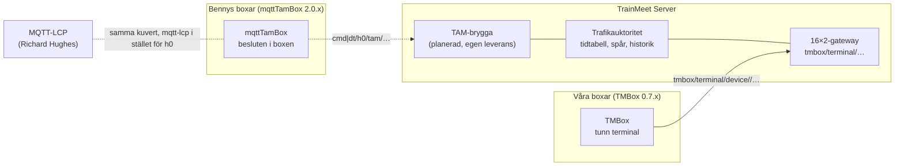

# TMBox mot MQTT-LCP och mqttTamBox

2026-10-01 · Casper. Analys, inte normtext; normtexten för 16×2-profilen finns i [docs/protocol/terminal16](../protocol/terminal16/README.md). Dokumentet finns också i Claude Docs: https://claude.ai/code/artifact/ff3370da-1d9e-4917-bfb1-5e8421423583

Trafikflödet i TMBox ligger mycket nära Bennys TAM-profil för MQTT-LCP, men meddelandena på tråden skiljer sig helt. En TAM-brygga i TrainMeet Server ger samspel utan att någon box i fält ändras.

## Släktskapen och arkitekturen

TMBox är en efterföljare till Bennys mqttTamBox: samma ESP8266, samma 16×2-display och 4×4-knappsats via PCF8574 och samma utfarter A–D. Skillnaden är var besluten fattas – i mqttTamBox i varje box, i TMBox i TrainMeet Server.



Bennys boxar talar TAM med bryggan, våra boxar talar med Servern som förut, och bryggan översätter mellan dem. Den streckade bryggan är planerad som en egen leverans.

## Trafikflödet: nästan ett till ett

Bennys TAM och TrainMeets klarering beskriver samma sak: begär, klart eller neka, avgång, ankomst. Tre skillnader återstår: återtag efter klartecken, ankomstspår och riktningsbyte på dubbelspår.

| Steg | Bennys TAM (mqttTamBox 2.0.12) | TrainMeet (v2-kommando / 16×2-boxen) | Avstånd |
| --- | --- | --- | --- |
| Begär klartecken | `cmd/h0/tam/<granne>/<utfart>/req`, `desired: accept`, `identity` = tågnummer, `track` | `clearance.request` för rörelse och sträcka; servern väljer granne ur tidtabellen | litet |
| Ge klart / neka | svar `reported: accepted` / `rejected` | `clearance.response` med `approved` sant/falskt | inget |
| Återta begäran | `desired: cancel` innan svar | `clearance.cancel` medan den väntar | inget |
| Återta klartecken | finns inte | tillåtet fram till avgång | saknas hos dem |
| Avgång | `dt/h0/tam/<box>/<utfart>`, `reported: out` | `train.departed` | inget |
| Ankomst | `reported: in` | `train.arrived` med ankomstspår | litet: spåret saknas hos dem |
| Riktningsbyte, dubbelspår | `desired: in` på ett spår | finns inte; dubbelspår är två fasta kanaler, en per riktning | saknas hos oss |
| Obesvarad begäran | avvisas av boxen själv efter 30 s | går ut på servern (`expired`); tiden står still när träffklockan står | litet |
| Tågnummer | fritt | ur tidtabellen, en rörelse per sträka | mellan |
| Orsak vid avvisning | ingen | maskinläsbar, t.ex. `channel_occupied` | litet |

Utfarterna stämmer redan: A och C till vänster, B och D till höger, både i Bennys box och i TrainMeets paneler.

## Tråden: format och transport

På tråden har TMBox inget gemensamt med de två andra. Bennys profil är MQTT-LCP med `h0` i stället för `mqtt-lcp` och två extra fält.

| Område | MQTT-LCP | Bennys TAM | TMBox (16×2-profilen) |
| --- | --- | --- | --- |
| Ämnen | `cmd\|dt/mqtt-lcp/<typ>/<nod>/<port>[/req\|res]` | `cmd\|dt/<skala>/<typ>/<nod>/<port>[/req\|res]`, skala t.ex. `h0` | `tmbox/terminal/device/<id>/{hello,presence,command,frame,ack,alive}` |
| Kuvert | rot = typ; `version`, `timestamp`, `session-id`, `node-id`, `port-id`, `respond-to`, `state{desired,reported}`, `metadata` | samma, plus `track` och `identity` direkt i meddelandet | platt JSON med `boot` per anslutning |
| Vem talar med vem | nod till nod | box till box | box till server; servern är enda trafikauktoritet |
| Livstecken | `dt/…/ping/<nod>` var 10:e sekund | samma, med `metadata{type,ver,name,sign,rssi}`; `$state` sparas som "ready" | fråga och svar med nonce var 5:e sekund; boxen ger upp efter 15 s; okänd session får tystnad så att boxen hälsar om |
| Konfiguration | fast `config.json` per nod | HTTP `mqtt-broker.local/?id=<box>` ger grannar per utfart, spårtyp, broker och skala | Cloud-publikation; administratören tilldelar station och sida |
| Upptäckt | fast `mqtt-broker.local` | samma, med inloggning från konfigurationsservern | DNS-SD `_tmbox._tcp` + `server_id`; anonym broker på träffens nät |
| QoS och retain | QoS 0 räcker; inget retain | QoS 0; ett sparat `$state` | QoS 1; retain förbjudet åt båda håll |
| Fjärrstyrning | `node`: shutdown | `node`: reboot, shutdown, inventory | ingen |
| Display | klienten ritar sitt eget gränssnitt | boxen ritar lokalt; svenska och engelska | servern skickar färdiga 2×16-rader och tangenter med `acts`; fem språk |

## Samma steg i tre protokoll

Steget är "begär klartecken för ett tåg". I TAM och MQTT-LCP säger boxen vad den vill. I TMBox trycker boxen på en tangent och servern avgör vad trycket betyder.

**Bennys TAM** (ur wikisidan "6. Format and Examples"):

```json
cmd/h0/tam/tambox-2/a/req
{"tam": {"version": "1.0", "timestamp": 1707768634, "session-id": "req:1707768634",
  "node-id": "tambox-2", "port-id": "a", "track": "right", "identity": 2123,
  "respond-to": "cmd/h0/tam/tambox-1/a/res", "state": {"desired": "accept"}}}
```

**MQTT-LCP**, närmaste motsvarighet: en handkontroll ansluter till en nod (ur wikin, "Cab Messages"):

```json
cmd/mqtt-lcp/cab/mqtt-dcc-command/desktop-throttle/req
{"cab": {"version": "1.0", "timestamp": 1577804139, "session-id": "req:1577804139",
  "respond-to": "cmd/mqtt-lcp/node/desktop-throttle/res", "node-id": "mqtt-dcc-command",
  "port-id": "desktop-throttle", "state": {"desired": "connect"}}}
```

**TMBox**, fångat från mosquitto i vår rigg 2026-10-01 (bilden förkortad):

```json
tmbox/terminal/device/esp8266-308398b57200/command
{"command_id": "7cd2916f535b49d2-1-2", "view_token": "dfe2bb9d4d9a68fe8e5991e3", "key": "#",
  "train_number": "428", "entry_context": "…:esp8266-308398b57200:st-vst", "boot": "7cd2916f535b49d2-1"}

tmbox/terminal/device/esp8266-308398b57200/ack
{"status": "accepted", "message": "", "command_id": "7cd2916f535b49d2-1-2",
  "frame": {"profile": "server-16x2", "lines": ["CDA-428         ", "#Beg A:Kö  09:00"],
            "keys": {"#": {"label": "Begär klartecken", "acts": true}, …}, "view_token": "9502eba8…"}}
```

Sedan Server 2.1.0 begär samma tryck klartecken direkt, och bilden i kvittot blir
`CDA?428` / `*Åter B:Öv` i stället för `CDA-428` / `#Beg A:Kö`.

Livstecknet, också fångat:

```json
tmbox/terminal/device/esp8266-308398b57200/presence  {"nonce": "7cd2916f535b49d2-1-p1", "boot": "7cd2916f535b49d2-1"}
tmbox/terminal/device/esp8266-308398b57200/alive     {"boot": "7cd2916f535b49d2-1", "nonce": "7cd2916f535b49d2-1-p1"}
```

## Vad som ändras hos oss

Allt som behös för samspel görs i TrainMeet Server. Boxarna i fält (firmware 0.7.3) behåller sitt protokoll.

1. **Städa innan vi kallar det standard** (bara dokumentation):
   - Skriv en normtext för 16×2-profilen: ämnen, kuvert, boot- och sessionsregler, `command_id`, `view_token`, QoS 1, inget retain, tidsgränserna 5/15/30 s.
   - Lös motsägelsen: v2-specens §8 säger att `#` aldrig får lämna ett operativt beslut, men 16×2-boxen ger klart med `#`. Normtexten får gälla för 16×2, och §8 får en hänvisning dit.
2. **TAM-brygga i Servern** (egen leverans):
   - Varje TrainMeet-station blir en TAM-nod på `cmd|dt/<skala>/tam/<station>/<utfart>`.
   - `accept`, `cancel`, `out` och `in` översätts till och från våra kommandon.
   - Ping var 10:e sekund med `metadata{type, ver, name, sign}`, som Bennys boxar.
   - Då kan en mqttTamBox 2.0.x vara granne till en TrainMeet-station på samma träff.
3. **Konfigurationsserver för Bennys boxar:** Servern kan svara på `/?id=<box>` med grannar per utfart. De finns redan i Cloud-topologin och i TMBox-placeringen.
4. **Riktningsbyte på dubbelspår** (`desired: in`) saknas i vår modell och tas upp som eget arbete om Bennys boxar ska köra dubbelspår mot oss.
5. **Liten rättelse i firmware vid nästa version:** ESP8266 sparar fortfarande ett LWT (retained) på det gamla ämnet `tambox/v1/client/<id>/presence`. Det ska bort. *(Görs i firmware 0.7.4. Server 2.0.0 rensar sparade `tambox/v1`- och `tmbox/v2`-meddelanden hos mäklaren vid start.)*

## Vad som behöver ändras hos dem

TAM-profilen behöver sex tillägg för att bära det TrainMeet gör. Alla är frivilliga fält eller nya värden, så Bennys boxar med 2.0.x fungerar som förut.

| Tillägg | Var | Varför |
| --- | --- | --- |
| Rollen *auktoritet*: en nod som svarar för en eller flera stationer; nod-id = stationens signatur, flera terminaler per station med sida | mqttTamBox-profilen | TrainMeet har en server som bestämmer, inte en box per station |
| `desired: revoke` fram till `out` | mqttTamBox-profilen | Återta ett beviljat klartecken före avgång |
| `metadata.arrival-track` i `reported: in` | mqttTamBox-profilen | Ankomstspår på stationen, inte bara vänster/höger linjespår |
| `metadata.movement-id` | mqttTamBox-profilen | Samma tågnummer kan gå flera gånger samma dag |
| `metadata.reason` vid `rejected`, t.ex. `channel-occupied`, `track-occupied`, `timeout` | mqttTamBox-profilen och MQTT-LCP | Visa varför, inte bara att |
| `metadata.boot` i ping | mqttTamBox-profilen och MQTT-LCP | En omstart syns, och en server som tappat sessionen kan säga till |

Till MQTT-LCP föreslås dessutom:

- Att typen `tam` och skalan i stället för `mqtt-lcp` på andra nivån tas in officiellt.
- Att specens egna motsägelser rättas:
  - `trains` mot `mqtt-lcp` på andra nivån
  - `dt` mot `dta`
  - `respond-to` mot `res-topic`
  - tidsstämplar i sekunder i specen men millisekunder i koden
  - att `session-id` ska vara unikt

## Risker och rekommendation

Rekommendationen är att gå via Bennys TAM-profil och bygga en brygga i Servern, inte att göra om boxens protokoll.

- **MQTT-LCP verkar vilande.** Senaste commit var 2024-03-04, senaste issue 2023-03-29, fyra issues står öppna och riktlinjer för bidrag saknas. Om någon tar emot förslag är inte verifierat. Bryggan ger samspel även om inget antas.
- **Deras brokrar har lösenord, våra boxar loggar inte in.** 0.7.3 kan bara tala med vår egen broker, så samspel går via Servern.
- **Ny firmware med deras format direkt** skulle kräva att boxen talar båda protokollen och att Servern servar det gamla för alltid. Minnet i ESP8266 med det större kuvertet är inte mätt. Föreslås inte nu.
- **Ordning:**
  1. Förankra hos Benny, eftersom TAM-profilen är hans.
  2. Städa hos oss: normtexten för 16×2-profilen.
  3. Skicka förslaget nedan som issue på etxbct/mqttTamBox och rphughespa/mqtt-lcp, och mejla Richard Hughes.
  4. Bygg TAM-bryggan som egen leverans med egen plan.

## Förslaget att skicka in (engelska)

Färdigt att klistra in som issue. Rubrik: *Proposal: a TrainMeet profile for TAM — authority nodes, revoke, arrival track and reasons*.

> **Summary.** TrainMeet runs TAM (tåganmälan) between stations with a central authority: TrainMeet Server owns the timetable, tracks and history, and its TMBox terminals are thin 16×2 keypad boxes. The traffic states map almost one to one onto the mqttTamBox profile (`accept` → `accepted`/`rejected`, `cancel`, `out`, `in`). We propose six optional additions so that TrainMeet stations and mqttTamBox 2.0.x boxes can be neighbours on the same layout. Nothing below changes what an existing box sends or must understand.
>
> 1. **Authority nodes.** A node may answer for one or more stations. Its `node-id` is the station signature (e.g. `cda`), and its ping carries `metadata.role: "authority"`. Several terminals may share a station, each for one side.
> 2. **Revoke a granted clearance** before departure: `{"state": {"desired": "revoke"}}` on the same topic as `cancel`, answered with `reported: "revoked"` until `out` has been reported.
> 3. **Arrival track:** `metadata.arrival-track` in `reported: "in"`, e.g. `"2"` — the station track, not the left/right line track.
> 4. **Timetable identity:** `metadata.movement-id` next to `identity`, because one train number can run several times a day.
> 5. **Reasons:** `metadata.reason` with `rejected`, from a small list: `channel-occupied`, `track-occupied`, `timeout`, `not-in-timetable`.
> 6. **Boot id in ping:** `metadata.boot`, so a restart is visible and an authority that lost a session can say so.
>
> Example, train 2123 rejected because the line is occupied:
>
> `cmd/h0/tam/cda/a/res` → `{"tam": {"version": "1.0", "timestamp": 1790869900, "session-id": "req:1790869880", "node-id": "cda", "port-id": "a", "track": "left", "identity": 2123, "state": {"desired": "accept", "reported": "rejected"}, "metadata": {"reason": "channel-occupied", "movement-id": "movement-2123-cda"}}}`
>
> For MQTT-LCP we also ask that the `tam` type and a scale (`h0`) in place of `mqtt-lcp` at the second topic level be recognised, and offer fixes for inconsistencies we met while implementing: `trains` vs `mqtt-lcp`, `dt` vs `dta`, `respond-to` vs `res-topic`, timestamp units (seconds in the wiki, milliseconds in the code) and unique `session-id`s.
>
> On our side we will publish a normative text for the TMBox 16×2 terminal profile and build a TAM bridge in TrainMeet Server, so each TrainMeet station appears as a TAM node. Contact: Casper (TrainMeet) and Benny Tjäder (mqttTamBox).

## Källor

Lästa 2026-10-01. Våra egna meddelanden är fångade i riggen samma dag.

- [mqttTamBox wiki: 6. Format and Examples](https://github.com/etxbct/mqttTamBox/wiki/6.-Format-and-Examples), Benny Tjäder, version 2.0.12 (feb 2025)
- [mqttTamBox, källkod och README](https://github.com/etxbct/mqttTamBox): `src/mqttTamBox/mqttTamBox.ino` (prenumerationer, konfigurationsservern, ping)
- [MQTT-LCP wiki: Messages](https://github.com/rphughespa/mqtt-lcp/wiki/MQTT-LCP-Messages), Richard Hughes
- [MQTT-LCP, källkod](https://github.com/rphughespa/mqtt-lcp): senaste commit 2024-03-04
- [MQTT-LCP issues](https://github.com/rphughespa/mqtt-lcp/issues): fyra öppna, senaste 2023-03-29
- TrainMeet Server: `src/tmbox_gateway/terminal16_mqtt.py`, `terminal16.py`, `protocol_v2.py`, `docs/protocol/v2/README.md` (§7.1, §8)
- TMBox firmware: `firmware/common/server_terminal.h`, `server_discovery.h`, `firmware/esp8266/TrainMeetTambox8266/TrainMeetTambox8266.ino` (rad 506–510, det gamla LWT:t)
